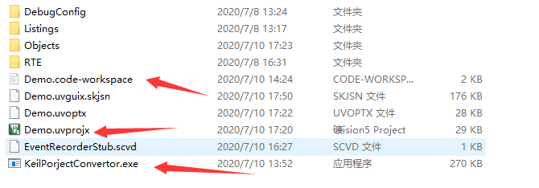
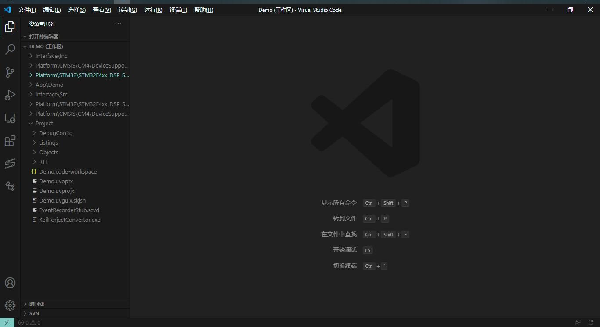
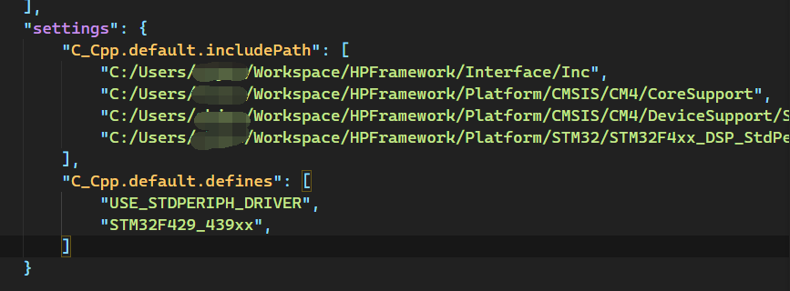

# KeilProjectConvertor
## 使用指南
将KeilProjectConvertor.exe放在需要转换工程的工程目录下，双击运行即可。

## Convert Target
### VS Code Workspace

现KeilProjectConvertor只支持转换为VS Code workspace，自动添加Keil工程中用户宏定义、Include Path以及源文件。

